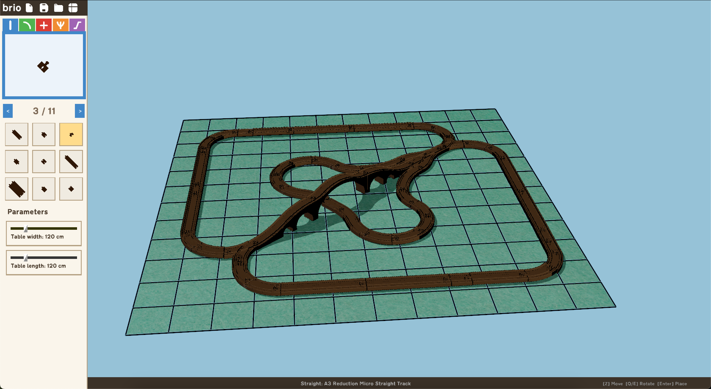

# Brio

A Python package for brio-style railway track design and management with 3D visualization.




## Features

- **Track Management**: Create, edit, and manage railway tracks with various types (straight, curved, elevated, switches, crossings)
- **3D Visualization**: Interactive 3D editor with camera controls
- **Collision Detection**: Robust collision detection for automatic linking
- **GUI Interface**: User-friendly graphical interface for track design
- **State Management**: Save and load track configurations
- **Export Functionality**: Export BOM for 3D printing

## Project Structure

```
brio/
├── controls/          # Camera and selection controls
├── gui/              # GUI components (file browser, gallery, properties)
├── models/           # Data models (track, table)
├── state/            # State management and export
├── tools/            # Specialized tools (collision editor)
├── assets/           # Track models, textures, fonts, icons
│   └── models/
│       ├── Straight/    # Straight track pieces
│       ├── Curved/      # Curved track pieces
│       ├── Elevated/    # Elevated/bridge tracks
│       ├── Crossing/    # Track crossings
│       └── Switches/    # Track switches
└── main.py           # Main application entry point
```

## Installation

```bash
git clone https://github.com/jaredcasarez/brio
pip install -e .
```

## Usage

```bash
brio
```

## Requirements

- Python 3.7+
- Panda3D (for 3D graphics and physics)
- panda3d-simplepbr

## License

MIT License
